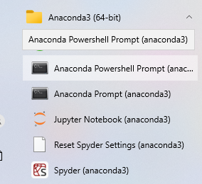
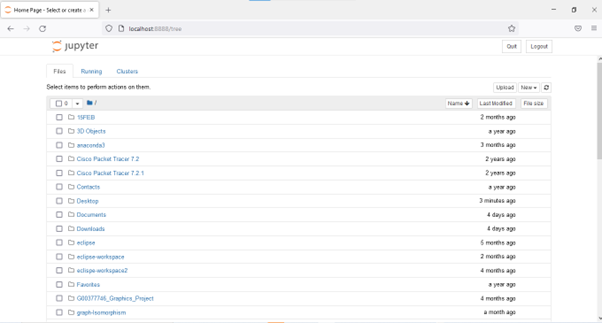

# Graph-Theory-Autumn-Repeat
The purpose of this repository is to demonstrate and explain heap sort and graph isomorphism using python code and notes. 

For heap sort we will explain
* what a rooted binary tree is
* how the heap sort algorithm works, with reference to trees
* why, in the worst case, heap sort is more efficient than bubble sort

For graph isomorphism, we will explain
*  The definition of graph isomorphism
*  The Specification of the Graph Isomorphism Problem.
*  the main reason computer scientists are interested in the complexity of
the Graph Isomorphism Problem

The instructions below will tell you how to setup and run the notebooks.

How To Setup Jumpter Notebook
Pre Requisites:

•	Download Anaconda 3 at https://www.anaconda.com/products/distribution

•	Download Firefox at https://www.mozilla.org/en-US/firefox/new/

1.	Start the jumpter notebook found in the start menu.

	
2.	Once you click “jumpter notebook”, it will run in the background and Firefox will open up and show you the page shown below.
	
3.	Open the files you cloned from the repository and put it in the file in the path “c//users/(username). Jumpter views all file in the path specified.
4.	Once you open the folder, there should be a file with .ipynb at the end of its name, open it.
5.	The file should open in the notebook and you should see something like the picture below.  
	
6.	Now you can run jumpter notebook and save your work once it is done.
